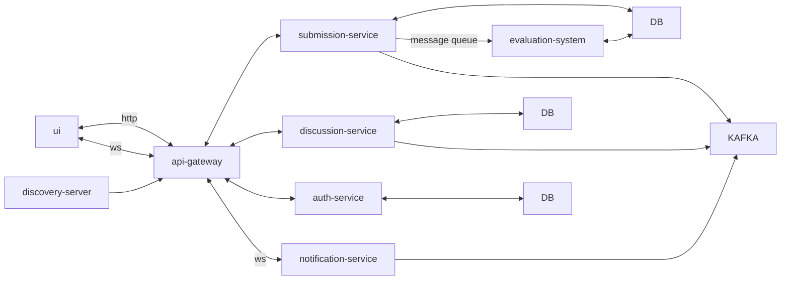

### code submission evaluation system

```mermaid
graph LR;
    ui<--http-->api-gateway
    ui<--ws-->api-gateway
    api-gateway<-->submission-service;
    api-gateway<-->discussion-service;
    api-gateway<-->auth-service;
    api-gateway<--ws-->notification-service;
    
    discovery-server-->api-gateway;
    auth-service<-->DB3[DB]
    submission-service<-->DB
    evaluation-system<-->DB
    submission-service--message queue-->evaluation-system
    discussion-service<-->DB2[DB]

    submission-service---->KAFKA;
    discussion-service---->KAFKA;
    notification-service---->KAFKA;


```